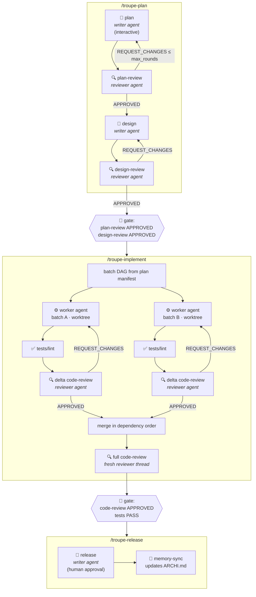
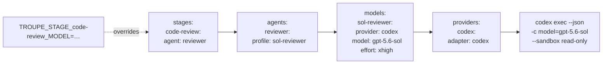
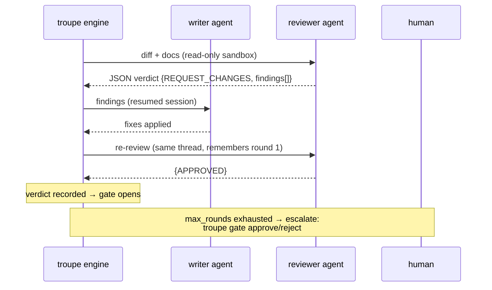

# troupe 🎭

**Multi-agent dev workflow orchestrator.** Plan → Design → Implement → Release,
with a different AI model at every stage if you want — and gates that agents
*cannot* skip, because the state machine lives in a CLI, not in prose.

Successor to [TRIP-workflow](https://github.com/PiLastDigit/TRIP-workflow):
same philosophy (writer ≠ reviewer, long-term ARCHI.md memory, few commands),
but models are config, gates are code, and any provider CLI can play.

## The troupe loop

Three commands drive the whole pipeline. Every box is an **agent** — a
provider CLI process (claude, codex, gemini, …) launched with the model and
knobs *you* configured for that stage.



## How an agent gets picked (config resolution)

Each stage names an **agent role**, roles bind to **model profiles**, profiles
name a **provider**, and the provider's **adapter** launches the real CLI.
Override at any level; env vars win for one-off runs.



Swap the reviewer model for **every** review stage by editing one profile —
or pin a single stage inline: `code-review: {provider: claude, model: haiku-4.5}`.

## The review loop (what "gates are code" means)



The reviewer must emit schema-validated JSON. No verdict on file → the next
stage refuses to start. An agent that ignores instructions can stall — never skip.

## Quick start

```bash
npm i -g @troupe/cli
cd your-repo && troupe init     # zero-config defaults, or pick a preset
/troupe-plan "add dark mode"    # in Claude Code — plan + reviews
/troupe-implement               # batched, gated, parallel if configured
/troupe-release                 # human-approved ship + memory sync
troupe status                   # where am I? · troupe report → cost per stage/model
```

`troupe init` also writes a workflow note into `CLAUDE.md`/`AGENTS.md`, so any
agent that opens the repo discovers the pipeline on its own.

## Configure any model for any stage

Copy profiles from **[`templates/troupe.config.example.yaml`](templates/troupe.config.example.yaml)**
into your `troupe.config.yaml` — it catalogs ready-made profiles for Claude
(fable, opus, sonnet, haiku), Codex (gpt-5.6 family, codex-mini), Gemini,
OpenCode and Mistral Vibe, with sensible knobs and $/Mtok pricing for the cost
ledger. Presets if you don't want to think:

| `mode:` | meaning |
|---|---|
| `solo` | one model everywhere (cheapest, no cross-check) |
| `duo`  | writer + cross-provider reviewer (TRIP's proven setup) |
| `full` | distinct tuned model per stage |

## Design docs

Full architecture & decisions: [`docs/superpowers/specs/2026-07-20-troupe-orchestrator-design.md`](docs/superpowers/specs/2026-07-20-troupe-orchestrator-design.md)
