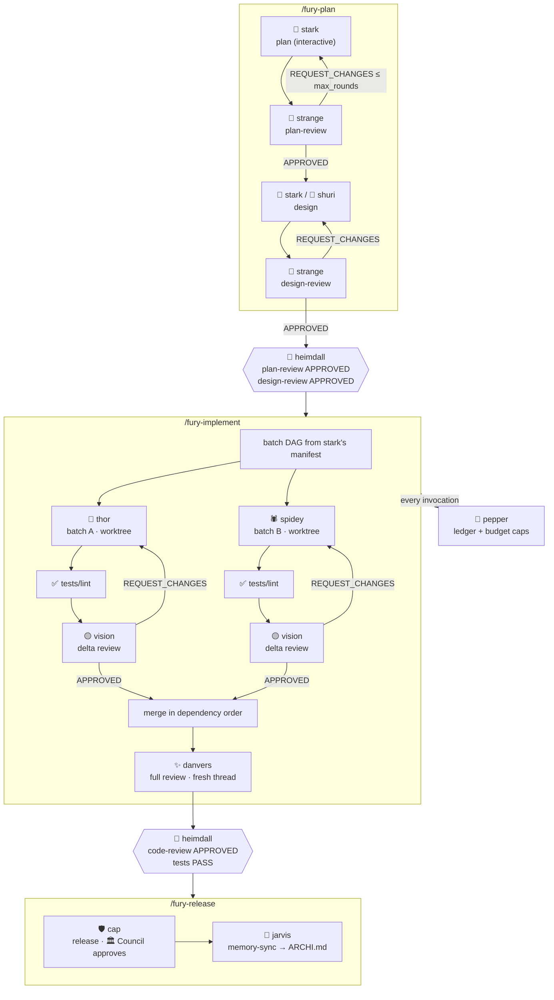
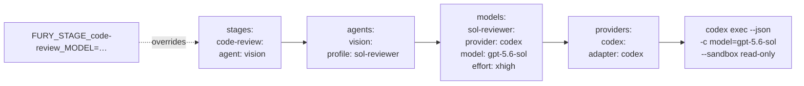
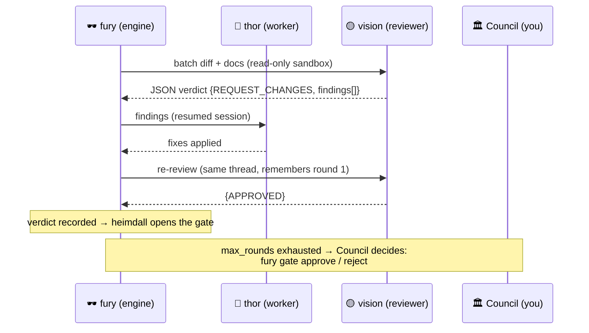

# fury 🦸

**The Avengers, but for your codebase.** A multi-agent dev workflow
orchestrator: Plan → Design → Implement → Release, with a different AI model
cast for every role — and gates that agents *cannot* skip, because the state
machine lives in a CLI (the Director), not in prose.

Successor to [TRIP-workflow](https://github.com/PiLastDigit/TRIP-workflow):
same philosophy (writer ≠ reviewer, long-term ARCHI.md memory, few commands),
but models are config, gates are code, and any provider CLI can join the team.

> `fury` never writes code. He assembles the team, hands out missions, guards
> the gates, keeps the ledger — and calls **you** (the World Security Council)
> when a mission needs a human decision.

## The roster

| Agent | Mission | Default casting |
|---|---|---|
| 🕶️ **fury** | The Director — the CLI engine itself. Orchestrates, enforces, never fights | deterministic code |
| 🤖 **stark** | Plans the mission & designs the architecture | strongest reasoning model |
| 🧬 **shuri** | UI/product design (`flavor: ui`) | strong + fast |
| 🔮 **strange** | Reviews plans & designs — checks 14,000,605 futures, approves the one that works | cross-provider reviewer, `effort: xhigh` |
| 🟡 **vision** | Delta code-review on each batch — precise, worthy | mid-tier |
| ✨ **danvers** | Final full-tree code review — flies in fresh, zero context contamination | big-context model |
| 🔨 **thor** / 💪 **hulk** | Heavy implementation batches & big refactors | strong workers |
| 🕷️ **spidey** / 🏹 **hawkeye** | Fast small batches / precision minor edits | cheap + fast |
| 🛡️ **cap** | Release: assembles notes, holds the line — ship order comes from you | reliable mid-tier |
| 🧠 **jarvis** | memory-sync: keeps `ARCHI.md` (long-term memory) current, compacts it | cheap |
| 💼 **pepper** | The ledger: every token & dollar. Budget breached → **Pepper freezes the card** (run pauses) | deterministic code |
| 🌈 **heimdall** | The gates. Nothing crosses without a recorded verdict | deterministic code |
| 🥷 **ronin** | Ad-hoc off-book missions (`--adhoc`): review anything, mutate nothing | any |
| 🧹 **Damage Control** | `fury clean` — dead worktrees, stale sessions | deterministic code |
| 🏛️ **You** | World Security Council: human gates, escalations, budget overrides | human |

Hero names are **agent roles in config** — cast any provider/model into any
role. Protocol constants stay boring (`APPROVED`, `plan-review`) so tooling
never depends on flavor.

## The mission loop



## How a hero gets cast (config resolution)



Recast one hero (edit one profile) and every stage they work changes. Or pin a
stage inline: `code-review: {provider: claude, model: haiku-4.5}`.

## The review loop (why agents can't skip gates)



Reviewers must emit schema-validated JSON verdicts. No verdict on file → the
next stage refuses to start. A disobedient agent can stall — never skip.

## Quick start

```bash
npm i -g @fury/cli               # publish name TBD (Marvel™ caveat)
cd your-repo && fury assemble    # zero-config defaults, or pick a preset
/fury-plan "add dark mode"       # in Claude Code — stark plans, strange reviews
/fury-implement                  # batched, gated, parallel if configured
/fury-release                    # cap ships it on your order, jarvis remembers
fury status                      # mission board · fury report → pepper's books
```

`fury assemble` also writes a workflow note into `CLAUDE.md`/`AGENTS.md`, so
any agent that opens the repo discovers the pipeline on its own.

Example board mid-mission:

```
run 2026-07-20-dark-mode          budget $9.40 / $25
  plan-review    APPROVED  (strange, round 2)
  design-review  APPROVED  (strange, round 1)
  implement      RUNNING
    🔨 thor    batch auth-api    round 2 · vision reviewing
    🕷️ spidey  batch ui-toggle   merged ✓
  code-review    pending → danvers
```

## Cast any model into any role

Copy profiles from **[`templates/fury.config.example.yaml`](templates/fury.config.example.yaml)** —
a catalog of ready-made profiles for Claude (fable, opus, sonnet, haiku), Codex
(gpt-5.6 family, codex-mini), Gemini, OpenCode and Mistral Vibe, with knobs and
$/Mtok pricing for pepper's ledger. Presets:

| `mode:` | meaning |
|---|---|
| `solo` | one model plays every hero (cheapest, no cross-check) |
| `duo`  | stark writes, strange reviews cross-provider (TRIP's proven setup) |
| `full` | the whole roster, each hero tuned separately |

## Design docs

Full architecture & decisions: [`docs/superpowers/specs/2026-07-20-fury-orchestrator-design.md`](docs/superpowers/specs/2026-07-20-fury-orchestrator-design.md)
